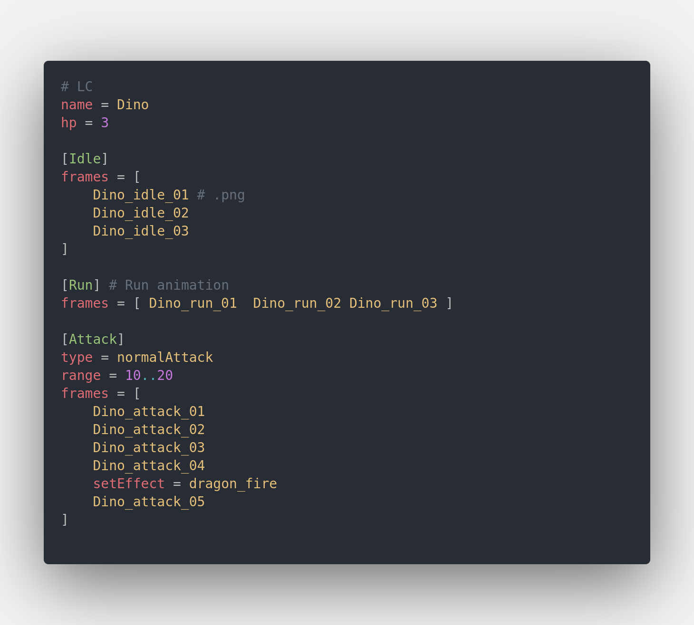

# LC support for vscode

Low-level Configuration Language

https://github.com/real-re/vscode-lc

[LC Home page](https://github.com/real-re/lc)

> Only support syntax

## Example

- TODO:
    - formatter
